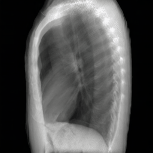

# SV-DRR: High-Fidelity Novel View X-Ray Synthesis Using Diffusion Model
MICCAI 2025

We propose a novel view-conditioned diffusion model for synthesizing
multi-view X-ray images from a single view.

The name SV-DRR, short for Single-View DRR, is inspired by Digitally Reconstructed Radiography (DRR).

Unlike DRR, which renders X-ray projections from a 3D CT volume, our method synthesizes novel views directly from a single 2D projection.

##  Usage

Work in progress

##  Training
Work in progress

##  Acknowledgement
This repository is based on the codebases below:

* [Zero1to3-hf](https://github.com/kxhit/zero123-hf) (HuggingFace Diffusers implementaiton of [Zero1to3](https://github.com/cvlab-columbia/zero123))
* [PixArt-Σ](https://github.com/PixArt-alpha/PixArt-sigma)
* [HF Diffusers](https://github.com/huggingface/diffusers)

<!-- ##  BibTex
If you find this work useful, a citation will be appreciated via: -->
