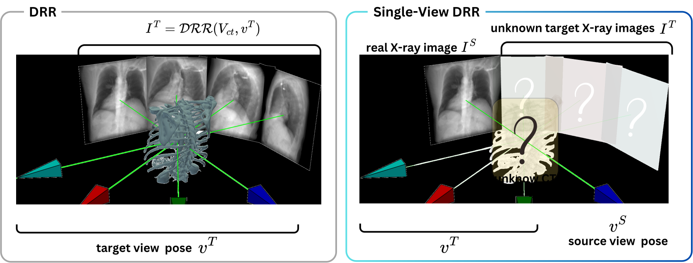

# SV-DRR: High-Fidelity Novel View X-Ray Synthesis Using Diffusion Model
MICCAI 2025

[](https://arxiv.org/abs/2507.05148)

**Authors:** Chun Xie, Yuichi Yoshii, Itaru Kitahara

University of Tsukuba | Tokyo Medical University Ibaraki Medical Center

## TL;DR
We propose a novel view-conditioned diffusion model for synthesizing
multi-view X-ray images up to 1024x1024 resolution from a single view.

<!--  -->

<p align="center">
    
</p>

## Visual Comparison with SOTA Methods

<!-- <p align="center">
    
</p> -->

## DRR vs. SV-DRR
The name SV-DRR, short for Single-View DRR, is inspired by Digitally Reconstructed Radiography (DRR).

Unlike DRR, which renders X-ray projections from a 3D CT volume, our method synthesizes novel views directly from a single 2D projection.


<!--  -->

##  Usage

Work in progress

##  Training
Work in progress

##  Acknowledgement
This repository is based on the codebases below:

* [Zero1to3-hf](https://github.com/kxhit/zero123-hf) (HuggingFace Diffusers implementaiton of [Zero1to3](https://github.com/cvlab-columbia/zero123))
* [PixArt-Σ](https://github.com/PixArt-alpha/PixArt-sigma)
* [HF Diffusers](https://github.com/huggingface/diffusers)

##  BibTex
If you find this work useful, a citation will be appreciated via:

```bibtex
@misc{xie2025svdrr,
      title={SV-DRR: High-Fidelity Novel View X-Ray Synthesis Using Diffusion Model}, 
      author={Chun Xie and Yuichi Yoshii and Itaru Kitahara},
      year={2025},
      eprint={2507.05148},
      archivePrefix={arXiv},
      url={https://arxiv.org/abs/2507.05148}, 
} 
```

