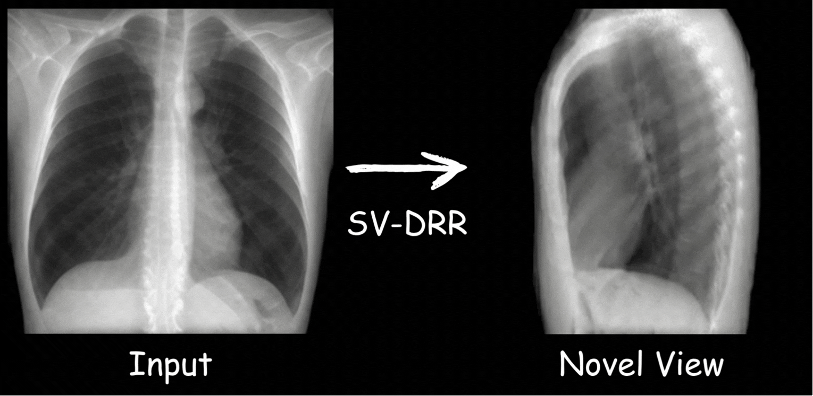
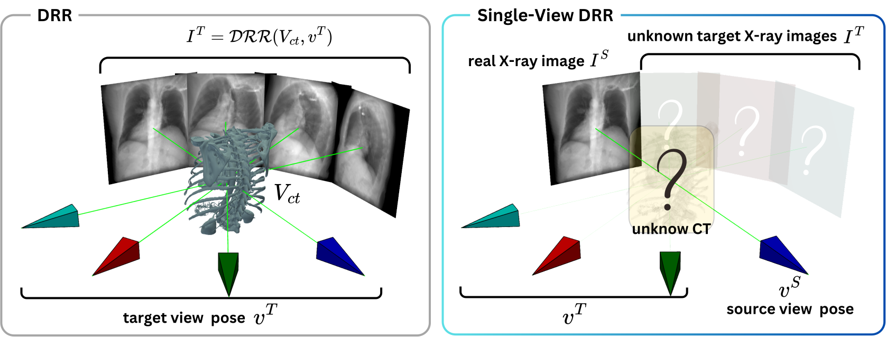

# SV-DRR: High-Fidelity Novel View X-Ray Synthesis Using Diffusion Model

<p align="center">
    <strong>MICCAI 2025</strong><br>
    
</p>

<p align="center">
    <a href="https://arxiv.org/abs/2507.05148"></a>
    <a href="https://link.springer.com/chapter/10.1007/978-3-032-04965-0_54"></a>
    <a href="https://www.canva.com/design/DAGydwPkSrA/JC3gkD94as9UqvY0pHE1XQ/view?utm_content=DAGydwPkSrA&utm_campaign=designshare&utm_medium=link2&utm_source=uniquelinks&utlId=h3d57eedde3"></a>
</p>

<p align="center">
    <strong>Authors:</strong> Chun Xie, Yuichi Yoshii, Itaru Kitahara<br>
    <em>University of Tsukuba | Tokyo Medical University Ibaraki Medical Center</em>
</p>

## 📰 News
- **[2025-10-05]** 🎉 Inference code and pretrained models are now available! You can now run SV-DRR on your own X-ray images.

## TL;DR
We propose a novel view-conditioned diffusion model for synthesizing
multi-view X-ray images up to 1024x1024 resolution from a single view.

<p align="center">
    
</p>

## Visual Comparison with SOTA Methods

<!-- <p align="center">
    
</p> -->

## DRR vs. SV-DRR
The name SV-DRR, short for Single-View DRR, is inspired by Digitally Reconstructed Radiography (DRR).

Unlike DRR, which renders X-ray projections from a 3D CT volume, our method synthesizes novel views directly from a single 2D projection.


<!--  -->

##  Dataset
[Download the preprocessed DRRs](https://drive.google.com/drive/folders/17hl5JEplo1yznmM2GtdJzYGwwT0MiWqc?usp=drive_link) 

We synthesized 3000 DRR images for each CT by uniformly sampling on a sphere, but only the first 1500 images (on the PA view side) were used for the experiment.
The images are organized as follows:

    image_complex_fb_256  
        |-LIDC-IDRI-0001  
            |-0000.png   <- 0000 is always the standard PA view  
            |-0001.png          
            |-...
            |-2999.png 
            |-camera.json
        |-LIDC-IDRI-0002
        |-...
        |-camera_views.json  <- Spherical coordinates of each view, in radians
        |-patients.json  


##  Usage

You can download the pretrained models by either:

1. Running the provided script:
    ```
    python scripts/download_models.py
    ```
    This will download all models into the `models/` directory. 
    
    Shared components will be stored in the `shared/` folder, and symbolic links will be created in each model folder accordingly.
2. Or manually downloading the models from Hugging Face:
    - 256 resolution: https://huggingface.co/xiechun-tsukuba/svdrr-dit-fb-256
    - 512 resolution: https://huggingface.co/xiechun-tsukuba/svdrr-dit-fb-512
    - 1024 resolution: https://huggingface.co/xiechun-tsukuba/svdrr-dit-fb-1024

### Inference
Note: The coordinate system of LIDC-IDRI-DRR is opposite to the intuitive one — the polar angle increases downward, and the azimuth angle increases when rotating to the left.
To invert the pose coordinate system, use the `--flip_pose` option.

Perform inference on a single image:
```bash
# Default views (azimuth angles from -90° to 90° in 5° increments)
python test_svdrr_DiT.py --model_path models/DiT-fb-512 \
    --image_path demo/real_xray.jpg \
    --log_dir outputs/ \
    --image_size 512 \
    --simple_pose

# User-specified views defined in camera_views.json
python test_svdrr_DiT.py --model_path models/DiT-fb-512 \
    --image_path demo/real_xray.jpg \
    --log_dir outputs/ \
    --image_size 512 \
    --poses demo/camera_views.json

```
Perform inference on the LIDC-IDRI-DRR dataset:
```bash
python test_svdrr_DiT.py --model_path models/svdrr-DiT-fb-256 \
    --dataset {path/to/dataset/} \
    --log_dir outputs/ \
    --image_size 256 
```

### Training

#### 1. Prepare Base Model

First, download the base model pretrained by PixArt-Σ:

```bash
# For 256x256 resolution (default)
python scripts/download_base_model.py

# For 512x512 resolution
python scripts/download_base_model.py --size 512

# For 1024x1024 resolution
python scripts/download_base_model.py --size 1024
```

This will download the appropriate PixArt-Σ pretrained weights to `models/base-model/` and prepare them for SV-DRR training.

#### 2. Training Script
To train from the base model at 256×256 resolution, run:
```bash
accelerate launch train_svdrr_DiT.py \
    --pretrained_model_name_or_path "models/base_model/256" \
    --resolution 256 \
    --train_batch_size 64 \
    --lr_warmup_steps 1000 \
    --learning_rate 5e-6 \
    --train_data_dir "{path/to/256/dataset/}" \
    --output_dir "checkpoints/svdrr-DiT-fb-256" \
    --tracker_project_name "svdrr-DiT-fb-256" \
    --dataloader_num_workers 16 \
    --checkpointing_steps 1000 \
    --validation_steps 1000 \
    --num_validation_batches 8 \
    --checkpoints_total_limit 20 \
    --max_train_steps 200000 \
    --ct_thickness "thin" \
    --xray_orientation "PA" \
    --device_specific_seed \
    --use_seedable_sampler 
```
To resume training from a checkpoint, use:
`--resume_from_checkpoint {checkpoint}`
Here, `{checkpoint}` can be the path to a specific checkpoint file or simply "latest"

After reaching the maximum training steps, the ready-to-use inference pipeline will be automatically saved to the `final-pipeline/` folder under the specified `output_dir`.

To continue training at 512x512 resolution, run:
```bash
accelerate launch train_zero1to3_DiT.py \
    --pretrained_model_name_or_path "{path/to/256/model}" \
    --resolution 512 \
    --train_batch_size 32 \
    --lr_warmup_steps 1000 \
    --learning_rate 3e-6 \
    --train_data_dir "{path/to/512/dataset/}" \
    --output_dir "checkpoints/svdrr-DiT-fb-256-512" \
    --tracker_project_name "svdrr-DiT-fb-256-512" \
    --dataloader_num_workers 16 \
    --checkpointing_steps 1000 \
    --validation_steps 1000 \
    --num_validation_batches 8 \
    --checkpoints_total_limit 20 \
    --max_train_steps 100000 \
    --ct_thickness "thin" \
    --xray_orientation "PA" \
    --device_specific_seed \
    --use_seedable_sampler \
```


🚧 Training Code in Preparation 🚧

Thank you for your interest in this research! I am currently in the process of cleaning, documenting, and refactoring the training code used in my paper.

My goal is to make it public and reproducible for the community. Please be aware that the code in its current state is a work-in-progress and is not yet ready for use.

Please Star or Watch this repository to be notified of its official release. Thank you for your patience!


##  Acknowledgement
This repository is based on the codebases below:

* [Zero1to3-hf](https://github.com/kxhit/zero123-hf) (HuggingFace Diffusers implementaiton of [Zero1to3](https://github.com/cvlab-columbia/zero123))
* [PixArt-Σ](https://github.com/PixArt-alpha/PixArt-sigma)
* [HF Diffusers](https://github.com/huggingface/diffusers)

##  BibTex
If you find this work useful, a citation will be appreciated via:

```bibtex
@InProceedings{XieChu_SVDRR_MICCAI2025,
        author = { Xie, Chun AND Yoshii, Yuichi AND Kitahara, Itaru},
        title = { { SV-DRR: High-Fidelity Novel View X-Ray Synthesis Using Diffusion Model } },
        booktitle = {proceedings of Medical Image Computing and Computer Assisted Intervention -- MICCAI 2025},
        year = {2025},
        publisher = {Springer Nature Switzerland},
        volume = {LNCS 15963},
        month = {September},
        page = {572 -- 582},
        doi = {https://doi.org/10.1007/978-3-032-04965-0_54}
}

@misc{xie2025svdrr,
        title = {SV-DRR: High-Fidelity Novel View X-Ray Synthesis Using Diffusion Model}, 
        author = {Chun Xie and Yuichi Yoshii and Itaru Kitahara},
        year = {2025},
        eprint = {2507.05148},
        archivePrefix = {arXiv},
        doi = {https://doi.org/10.48550/arXiv.2507.05148}, 
} 
```

